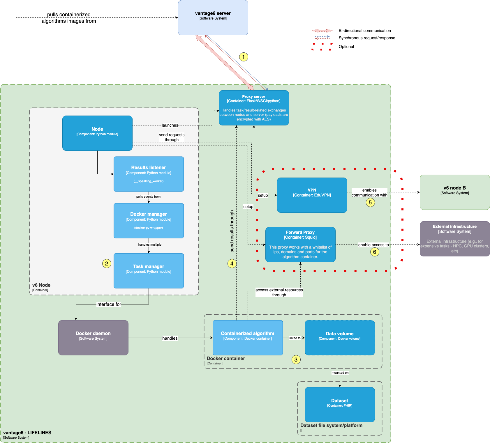

Building Block View
===================

## System context

MyDigiTwin is a scientific initiative that involves a cooperation between scientific a comercial partners. Consequently, MyDigiTwin as a technological product has two fundamental 'embodiments' given each partner main viewpoint: a patient-oriented user-friendly product to be integrated on [PGOs](./12.Glossary.md)' infrastructure, and a research enviroment where scientist can develop the back-bone of the said product: the CVD prediction models.

These predictions models are expected to be created from multiple big-data reference sets, and it is envisioned that new ones could be integrated as they become available. Given all this, the overall MyDigiTwin landscape can be described in term of actors and subsystems as follows:

As described in the diagram, in addition to the researchers and the partients, the system will involve the developers, domain experts, and data experts that will work on the integration of new reference datasets. They would perform tasks such as data harmonization, infrastructure configuration and adjustments for multi-data homogeninity. It is also important to highlight that there won't be a any kind of application-level interoperability between the end-user environment (which would be eventually deployed on multiple PGOs) and the research one. Instead, the PGOs will get access to the prediction models trained in the research environment, once the researchers have validated them.

### Federated learning strategy

MyDigiTwin is envisioned as a platform that could be integrated into a PGO platform to provide prediction, simulation, and guidelines verification services. Technically, this could be achieved by deploying MyDigiTwin as an API on its own infrastructure, so that any PGO can perform this integration by using this API remotely. 

However, this approach has the following drawbacks:
*	It would require exchanging the patient’s information (e.g., as the input for a prediction model) between the PGO and the said API. This means opening a weak spot for potential data breaches to take care of.
*	It is not clear on which premises this would be running, and who would be accountable for the computation costs. This is important particularly given that these services would be eventually used by multiple PGOs, and hence, by potentially thousands of patients concurrently.

Given the above, a better approach would be to distribute MyDigiTwin as a ‘containerized’ application image, that can be deployed within each PGO’s premises, along with copies of the prediction models, as depicted in the following diagram.

This approach, on the one hand, is safer as it would not require the exchange of patient information outside of the PGO environment. On the other, the computation costs of the services and the use of the pre-trained models would be covered by  PGO.

### Research context

The Research context (light green in the figure below), deals with the computational artifacts and infrastructure to train, evaluate, compare, and release prediction and validation models (which would be later used by the PGOs) from the available reference datasets and professional guidelines. Considering privacy-preserving concerns, the training process would follow a federated approach, that is to say, the data used for training would remain decentralized and distributed across multiple local sources or devices, and the model would be trained collaboratively without requiring the raw data to leave those sources or devices. This approach ensures that individual data privacy is protected while still enabling the model to learn from multiple reference datasets without centralizing them in one location.

## Level 2 building blocks - end-user environment (PGO)

> Work in progress.

## Level 2 building blocks: research environment

[
Strategy:

End-user environment, gets FHIR-complaint data for HR

Research environment:
	- Federated learning

]

### Federated learning node

- Data harmonization
- FHIR
- Harmoniozation tools
- Link to the tools

### Vantage6 - Personal health train

The federated learning architecture of MyDigiTwin's research context will be built on top of vantage6, an open-source privacy-preserving federated learning (FL) and multi-party computation (MPC) infrastructure for secure insight exchange. 

The vantage6 infrastructure is inspired by the Personal Health Train (PHT) concept, where vantage6 is the tracks and stations, compatible algorithms are the trains, and computation tasks are the journey. It is built on top of three pillars: Infrastructure, Algorithms, and Data [(See Vantage6 documentation)](https://docs.vantage6.ai/).

The following illustrates the kind of data exchanges performed to perform 

Vantage6 has both a client-server and peer-to-peer architecture. The client is used by the researcher to create computation requests and manage users, organizations, and collaborations. The server contains users, organizations, collaborations, tasks, and their results. It provides a central access point for both the clients and nodes. The nodes have access to privacy-sensitive data and handle computation requests retrieved from the server. Computation requests are executed as separate containers on the node. These containers are connected to containers at other nodes by a VPN network.

<!--pypi.org.
The Personal Health Train
The Personal Health Train (PHT) is the initiative to provide a solution to patient-level data sharing concerns.
**Component diagram (no node-to-node communication)
-->

## Level 3 building blocks: research environment

[WIP - Client details]

[WIP - Server details]

