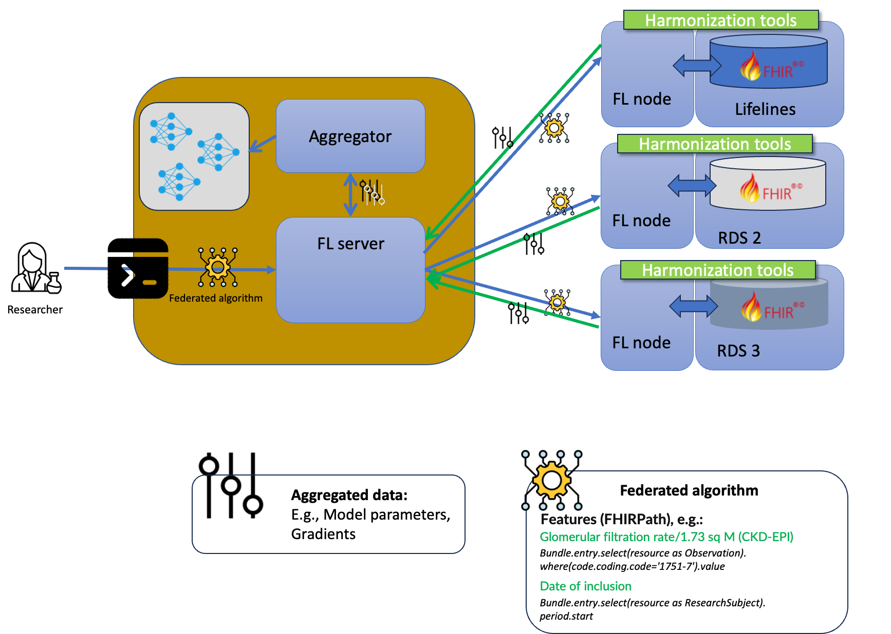

Building Block View
===================


# L1. System context

MyDigiTwin is a scientific initiative supported by the cooperation between scientific a comercial partners. Consequently, MyDigiTwin as a technological product has two fundamental 'embodiments' given each partner main viewpoint: a patient-oriented user-friendly product to be integrated on [PGOs](./12.Glossary.md)' infrastructure, and a research enviroment where scientist can develop the back-bone of the said product, that is to say, CVD prediction models.

These predictions models are expected to be created from multiple big-data reference sets, and it is envisioned that new ones could be integrated as they become available. Given all the above -as described in the diagram below- in addition to the researchers and the patients, the system will involve developers, domain experts, and data experts who will work on the integration of new reference datasets. In particular, the are expected to perform tasks such as data harmonization, infrastructure configuration and tuning for multi-data homogeninity.


Also according to the diagram, it is important to highlight that there won't be a any kind of application-level interoperability between the end-user environment (which would be eventually deployed on multiple PGOs) and the research one. Instead, the PGOs will get access to the prediction models trained in the research environment, once the researchers have validated them.

This approach, on the one hand, is safer as it would not require the exchange of patient information outside of the PGO environment (from the PGO to the research environment, or from the reference datasets to the PGO). 

## L2. Research environment

### Privacy-preserving Federated Learning (L2)

Ensuring that all MyDigiTwin partners, in particular researchers, can use health data without compromising individial's privacy is one of the system's [quality goals](./01.Introduction%20and%20Goals.md)). With this motivation, the core element of the research environment is a privacy-preserving federated learning architecture. This architecture (also referred to as Personal Health Train, or PHT, in the health care domain) allows multiple parties to collaboratively train models, or perform data analysis, without sharing raw data. Instead, each party performs local computations and updates on their data, and the model updates are shared with all parties.

As illustrated in the diagram below, each reference dataset would be part of the federated learning architecture as a node. Each node, based on a request sent by the central server (e.g., an algorithm), will locally train a machine learning model using its respective data, and return -rather than the raw data- only model updates or aggregated information. The central server, in turn, will aggregate and update a global model. This exchange between server and nodes is performed during multiple iterations, e.g., until a convergence criterion is met.



#### Data harmonization

One of the challenges of the federated learning architecture previously described is the heterogeinity of the involved reference datasets, i.e., variable names, data format, and the scales and units used. Harmonizing the data involves standardizing these differences to ensure compatibility and consistency, facilitating effective model training across all nodes.

Given that the research environment of MyDigiTwin is expected to integrate more reference datasets overtime, the harmonization strategy for its federating architecture is to make said datasets FHIR-compliant. This way, the federated algorithms could refer to variables within a reference dataset on a standardized fashion by using [FHIRPath](https://hl7.org/fhir/fhirpath.html) -the language for querying and navigating FHIR resources-.

As illustrated in the diagram above, it is then expected that each node will have a local copy of its corresponding dataset represented (transformed) as FHIR resources -a [FHIR bundle](https://build.fhir.org/bundle.html) for each data point-. More specifically, these FHIR resources would be compliant with the [Zib-profile (2017)](https://zibs.nl/wiki/ZIB_Publicatie_2017(NL)) published by [MedMij](https://informatiestandaarden.nictiz.nl/wiki/MedMij:Landingspagina_MedMij). 

To make this harmonization process as consistent as possible across multiple reference datasets, a number of tools are developed as part of MyDigiTwin. These are further described [for the particular context of Lifelines](https://github.com/MyDigiTwinNL/LifelinesDataAccessDocumentation).

## L3. End-user environment

The end-user environment, that is to say, the platform of a PGO, will be where patients will ultimately make use of the prediction and simulation features of MyDigiTwin. As described in the [system context](#l1-system-context), the backbone of these simulations would be the prediction models, created by the researchers, through the [research environment](#l2-research-environment). 


As it is expected for multiple PGOs to eventually integrate MyDigiTwin, it is envisioned a reusable, containerized 'MyDigiTwin module' (dark blue in the diagram) that provides high-level features for making use of the available prediction models, and'digitalized' professional guidelines. When this end-user environment is being setting up, or when new predictions models are available, the files with said models would be transferred through a secure channel between the research environment and the PGO.

Once this module, the models, and the guidelines are in place within the PGO, the following high-level steps would be performed when a patient request a simulation (this would be further specified on the [Runtime View](./06.Runtime%20View.md)):

1. The Patient access the PGO's and/or the MyDigiTwin-specific user interface to perform the request.
2. Once the patient is logged in, the PGO platform would pull the patient's health records it has access to.
3. The PGO transforms these health records into a FHIR bundle, which would be compliant with the same profile used for the [data harmonization](#data-harmonization) of the training data.
4. Depending on the variables the prediction model requires, the PGO platform would get the relevant variables values by using FHIRPath (the same kind of expressions used by the federated algorithms).
5. The PGO platform pass these variable values to the MyDigiTwin module, get the results, and present them to the users accordingly.


# L4. Research environment components

For the implementation of the [research environment](#l2-research-environment), vantage6 provides a flexible infrastructure for its underlying federated learning architecture. Vantage6 is an open-source platform inspired by the Personal Health Train (PHT) concept, which stands for privacy-preserving federated learning infrastructure for secure insight exchange. It is built on three fundamental principles: Autonomy, Heterogeneity, and Flexibility. Autonomy ensures that all parties involved in the federated learning process remain independent and autonomous. Heterogeneity allows parties to have differences in hardware and operating systems. Flexibility refers to how the platform do not impose restrictions on the data that can be used for training models.


The server is the central component of the vantage6 architecture. It stores information about organizations, users, and other aspects of pre-arranged collaborations for a particular training or data analytics process. 
and nodes to authenticate and interact through the API that it hosts. A node, on the other hand, is a piece of software running in the same premises as each dataset involved on a federated learning task. It is responsible for locally executing computation tasks (e.g., local training) and returning the results to the server. 

The diagram above illustrates how vantage6 would handle a request to execute an algorithm within a collaboration (an agreement between two or more parties to participate in a study). For the sake of simplicity, This algorithm only involves two nodes: 'Organization A', and 'Aggregator'. The former, is expected to process its local dataset, whereas the latter would simply aggregate partial results from other nodes:

``````
central_algorithm()
	results_a = run(intermediate_algorithm,Organization-A)
	aggregate(results_a, central_model)

``````
``````
intermediate_algorithm()
	results = local_training(local_dataset)
	post_result(results)
``````

The above algorithms _Central_algorithm_ and _Intermediate_algorithm_ (presented in pseudo-code for simplicity), are expected to be executed as follows:

1. A server client (e.g., a researcher) requests the execution of _central_algorithm_ on the 'Aggregator node'.
2. The server will notify the 'Aggregator node' about this new task.
3. The 'Aggregator node' pulls the algorithm form a container registry.
4. As described on the pseudo-code, once executed, _central_algorithm_, will request the server to run the 'intermediate_algorithm' on Organization-A's node.
5. The server, in turn, will notify 'Organization A' about the request for running the'intermediate_algorithm'.
6. Organization-A also pulls the said algorithm from the container registry.
7. The _intermediate_algorithm_ algorithm process the data it has access to.
8. The _intermediate_algorithm_ sends aggregated data, to the aggregator, through the server.
9. The server post the partial results to the Aggregator node.
10. The aggregator node uses the partial results from Organization A, and from other nodes (not described in these steps), to create a unified, central model. 

The steps above do not mention many security considerations involved in the process (these are addressed in [the Risks section](./11.Risks%20and%20Technical%20Debt.md)). However, it is worth noticing that in the default vantage6 architecture, the nodes (where the datasets reside) only perform outbound communications to the server. That is to say, there is no need to open any kind of ports where data resides.


<<<<<<< HEAD
nictiz.fhir.nl.stu3.zib2017 - 2.2.8


https://simplifier.net/packages/nictiz.fhir.nl.stu3.zib2017 ()

additional ones over time, the harmonization strategy 

This makes difficult and error-prone the development of the federated algorithms, as


The federated learning architecture previously described has 


a Personal Health Train (PHT) is the guiding concept for the research environment architecture. On a PHT -a railroad system metaphore-, a train station is where each dataset resides and is accessible (locally) as a FAIR data access point. A train (the only element that actually moves between systems), in this case, correspond to the artifacts required to execute an algorithm on a distributed fashion. 


is adopted as the guideline for the architecture of the research environment.

The PHT approach shifts the focus from sharing data to sharing processing/analysis applications and their respective results.


[PGOs](./12.Glossary.md)

The rationale of the Personal Health Train (PHT) approach shifts the focus from sharing data to sharing processing/analysis applications and their respective results. A prerequisite of the PHT-infrastructure is that the data is FAIR (findable, accessible, interoperable, reusable). 

The PHT approach is a specific implementation of federated learning in the context of healthcare. The PHT paradigm shifts the focus from sharing data to sharing processing/analysis applications and their respective results. The aim is to analyze data in a privacy-preserving federated manner, meaning the data never leaves the source


### Federated learning architecture


### PGO health records and 


MyDigiTwin is envisioned as a platform that could be integrated into a PGO platform to provide prediction, simulation, and guidelines verification services. Technically, this could be achieved by deploying MyDigiTwin as an API on its own infrastructure, so that any PGO can perform this integration by using this API remotely. 

However, this approach has the following drawbacks:
*	It would require exchanging the patient’s information (e.g., as the input for a prediction model) between the PGO and the said API. This means opening a weak spot for potential data breaches to take care of.
*	It is not clear on which premises this would be running, and who would be accountable for the computation costs. This is important particularly given that these services would be eventually used by multiple PGOs, and hence, by potentially thousands of patients concurrently.

Given the above, a better approach would be to distribute MyDigiTwin as a ‘containerized’ application image, that can be deployed within each PGO’s premises, along with copies of the prediction models, as depicted in the following diagram.


### Research context

The Research context (light green in the figure below), deals with the computational artifacts and infrastructure to train, evaluate, compare, and release prediction and validation models (which would be later used by the PGOs) from the available reference datasets and professional guidelines. Considering privacy-preserving concerns, the training process would follow a federated approach, that is to say, the data used for training would remain decentralized and distributed across multiple local sources or devices, and the model would be trained collaboratively without requiring the raw data to leave those sources or devices. This approach ensures that individual data privacy is protected while still enabling the model to learn from multiple reference datasets without centralizing them in one location.


## Level 2 building blocks - end-user environment (PGO)

> Work in progress.

## Level 2 building blocks: research environment

[
Strategy:


End-user environment, gets FHIR-complaint data for HR


Research environment:
	- Federated learning


]

### Federated learning node

- Data harmonization
- FHIR
- Harmoniozation tools
- Link to the tools

### Vantage6 - Personal health train

The federated learning architecture of MyDigiTwin's research context will be built on top of vantage6, an open-source privacy-preserving federated learning (FL) and multi-party computation (MPC) infrastructure for secure insight exchange. 

The vantage6 infrastructure is inspired by the Personal Health Train (PHT) concept, where vantage6 is the tracks and stations, compatible algorithms are the trains, and computation tasks are the journey. It is built on top of three pillars: Infrastructure, Algorithms, and Data [(See Vantage6 documentation)](https://docs.vantage6.ai/).

The following illustrates the kind of data exchanges performed to perform 


Vantage6 has both a client-server and peer-to-peer architecture. The client is used by the researcher to create computation requests and manage users, organizations, and collaborations. The server contains users, organizations, collaborations, tasks, and their results. It provides a central access point for both the clients and nodes. The nodes have access to privacy-sensitive data and handle computation requests retrieved from the server. Computation requests are executed as separate containers on the node. These containers are connected to containers at other nodes by a VPN network.

<!--pypi.org.
The Personal Health Train
The Personal Health Train (PHT) is the initiative to provide a solution to patient-level data sharing concerns.
**Component diagram (no node-to-node communication)
-->


## Level 3 building blocks: research environment

[WIP - Client details]
=======
<!--
Inside the node
>>>>>>> 4c77310 (building blocks updated up to L3)


[WIP - Server details]


-->