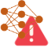
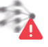
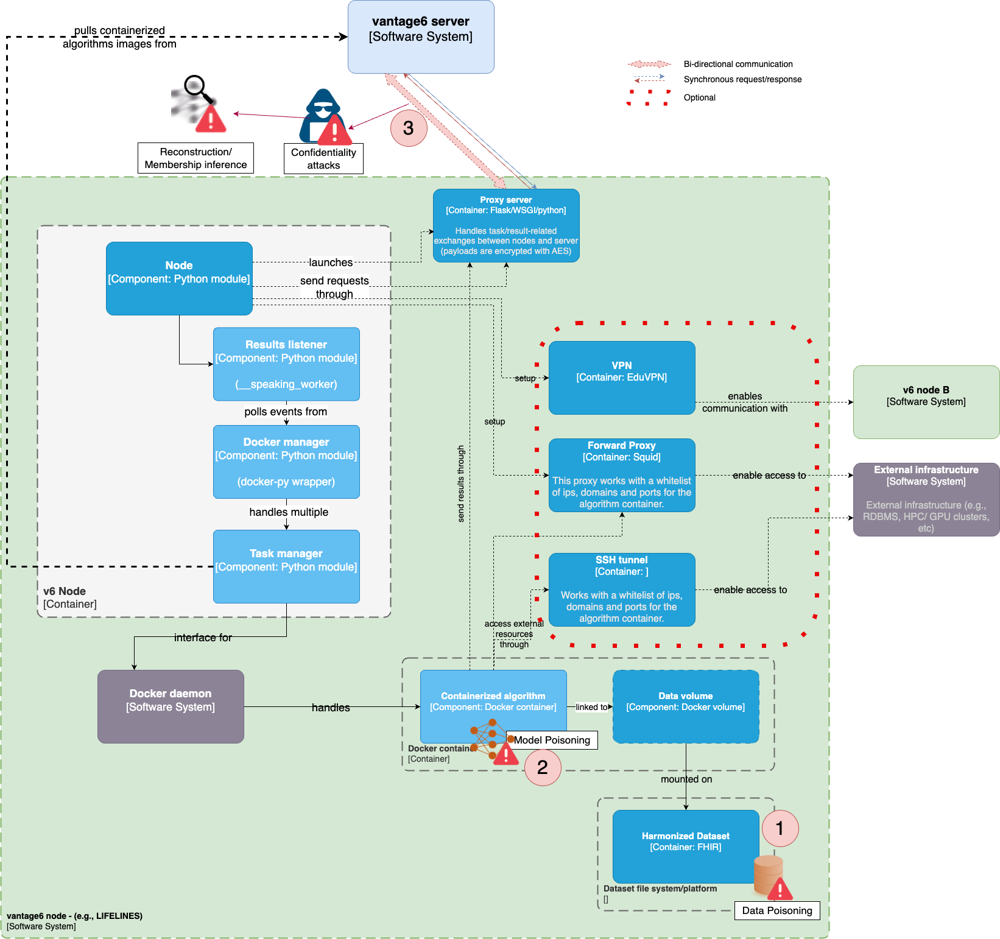
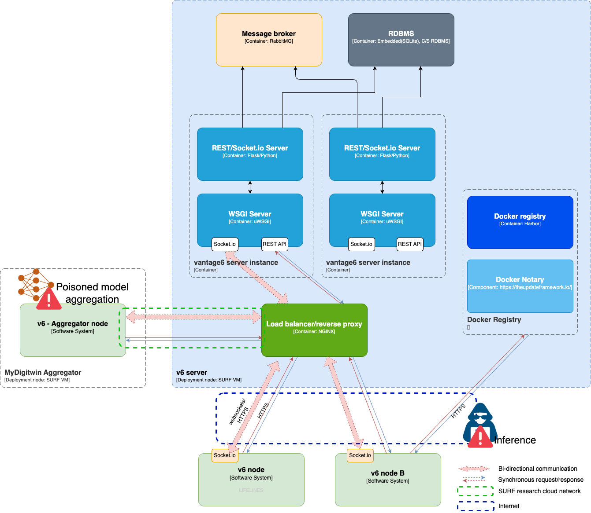

Risks and Technical Debts 
=========================

## IA model-related security risks

| ID | Risk |Symbol | Related to | Measures | References |
|--|--|--|--|--|--|
| R1 | **Confidentiality attacks** | |  |  |[[1]](#references)|
| R1.1 | Sensitive information leaking | |  |[SMC](#secure-multi-party-computation)  |[1] |
| R1.2 | Eavesdropping ||  |[Secure communication protocols](#secure-communication-protocols), MFA, [DP](#differential-privacy) |[4] |
| R2 | Integrity attacks | |  | | |
| R2 | Incorrect results | |  | | |
| R1 | (A)vailability attacks | |  |[SMC](#secure-multi-party-computation)  |[1] |
| R2 | **Poisoning attacks**|  |  |  |[1] |
| R2.1 | Data poisoning | | R7 |[DP](#differential-privacy), [HME](#homo-morphic-encryption)  |[1] |
| R2.2 | Model poisoning | |R5  |[Secure communication protocols](#secure-communication-protocols), cryptographic techniques|[1] |
| R3 | **Inference attacks** | |  | | |
| R3.1 | Reconstruction|  |  |DP, Robust Aggregation Algorithms  |[1][3][4] |
| R3.2 | Model inversion| |  |[DP](#differential-privacy), [HME](#homo-morphic-encryption)  |[1] |
| R3.3 | Membership inference| |  |[DP](#differential-privacy), [HME](#homo-morphic-encryption), Regularisation, Training data reduction  |[1] |
| R3.4 | Generative Adverserial Networks (GAN)||R5  |[SMC](#secure-multi-party-computation),[DP](#differential-privacy),TEE,[HME](#homo-morphic-encryption) |[1] |
| R4 | **Free-riding attacks**| |  || |
| R4.1 | Malicious participants| |  || |

### Confidentiality attacks

#### Data misuse

The risk of data being improperly used or exploited, whether intentionally or unintentionally, leading to breaches of privacy or misuse of sensitive information.

#### Model inversion

An attack where an adversary attempts to reverse-engineer or extract sensitive information about the training data used to build the model.

#### Membership inference

A scenario where an attacker tries to determine if a specific sample was part of the training dataset used to create the federated learning model.

#### Generative Adversarial Networks (GAN)

A type of machine learning model that can be used maliciously to generate synthetic data resembling real data, potentially used to deceive or manipulate the federated learning process. They can be used to create adversarial examples, which are inputs designed to mislead a machine learning model. These adversarial examples can then be used to do Membership inference atacks, that is to say, to infer the membership of a data point in the training dataset of the model.

#### Model poisoning

Occurs when a malicious participant in the federated learning process intentionally introduces biased or corrupted data to manipulate the model's performance.

#### Reconstruction

The process of reconstructing or inferring sensitive or private information using only publicly available data, e.g., public aggregate statistics about the dataset.

#### Eavesdropping

The unauthorized interception of communication between participants in a federated learning system, leading to potential exposure of sensitive data or model details.

#### Backdoor attacks

An attacker, through one of the parties, insert hidden triggers in the global model after training -while maintaining the accuracy of clean data-, generally by changing specific features.

## Measures description & application

#### Secure Multi-Party Computation: 
Secure Multi-Party Computation (SMC) is a cryptographic method that allows multiple parties to compute a function over their inputs while keeping those inputs private. In the context of federated learning, SMC can be used to ensure that the model updates are computed securely without revealing the local data to the server.

#### Differential Privacy: 
Differential Privacy (DP) is a privacy-preserving technique that adds noise to the data or the model updates to prevent the identification of individual data points. This can help to prevent the compromise of individual data even if the source data itself is compromised.

#### Homo-morphic Encryption: 
Homo-morphic Encryption (HME) is a cryptographic method that allows computations to be performed on ciphertext, generating an encrypted result which, when decrypted, matches the result of operations performed on the plaintext. This can be used in federated learning to allow computations to be performed on encrypted data without revealing the data to the server.

#### Secure Communication Protocols: 
Secure communication protocols are methods used to ensure that data transmitted between parties is secure and cannot be intercepted or tampered with. In federated learning, secure communication protocols can be used to ensure that the model updates are transmitted securely from the client to the server.

#### Regularisation: 
Regularisation is a technique used in machine learning to prevent overfitting by adding a penalty term to the loss function. In federated learning, regularisation can be used to ensure that the model updates do not cause the global model to overfit to the local data.

#### Training Data Reduction: 
Training data reduction is a technique used to reduce the amount of data used for training. This can help to reduce the risk of backdoor attacks by limiting the amount of data that can be used to inject malicious updates. In federated learning, this can be achieved by using techniques such as data sampling or data compression.

#### TEE - Trusted Execution Environment: 
A Trusted Execution Environment (TEE) is a secure area of a main processor where sensitive computations can be performed. In federated learning, a TEE can be used to ensure that the computations performed on the local data are secure and cannot be tampered with.

#### Robust Aggregation Algorithms: 
Robust aggregation algorithms are methods used to combine the model updates from multiple clients in a way that is resistant to malicious updates. In federated learning, robust aggregation algorithms can help to ensure the integrity of the global model and resist backdoor attacks.

#### Norm Thresholds: 
Norm thresholds are used to limit the magnitude of the updates sent from the client to the server in federated learning. By setting a threshold on the norm (or length) of the update vector, one can prevent the introduction of large updates that could potentially contain malicious data. This can help to prevent backdoor attacks by ensuring that the updates sent to the server are within an acceptable range.

## Risks in the context of MyDigiTwin v6-supported architecture

### Risk targets - vantage6 node

| Measure | Accountable party | Description | References |
|---|-----|----|---|
| SMC | vantage6 core | the platform supports...| |
| DP | algorithm developer | to be included in FL algorithm | | 
| Secure communication protocols | node infrastrucrure admins, vantage6 node installer | (1) setup/enabling vantage6's [AES](https://en.wikipedia.org/wiki/Advanced_Encryption_Standard) encryption (see Fig. X, step 5)   | | 
| HME | node infrastrucrure admins, vantage6 node installer | Homomorphic encryption can be performed on the nodes (e.g., lifelines) during the local training phase. The local dataset is encrypted before performing the training. After the local model is trained, the updates to the model parameters are encrypted and sent to the server. The server then aggregates these encrypted updates and sends them back to the nodes.  | |
| Secure communication protocols | vantage6 core, node manager | aaa | | 

### Risk targets - vantage6 server

| Measure | Accountable party | Description | References |
|---|-----|----|---|
| Secure communication protocols | node infrastrucrure admins, vantage6 node installer | (1) enabling vantage6's [AES](https://en.wikipedia.org/wiki/Advanced_Encryption_Standard) encryption (see Fig. X, step 5) (2) setting up digital certificates and HTTPS on server's reverse proxy | | 
| HME | node infrastrucrure admins, vantage6 node installer | Homomorphic encryption can be performed on the nodes (e.g., lifelines) during the local training phase. The local dataset is encrypted before performing the training. After the local model is trained, the updates to the model parameters are encrypted and sent to the server. The server then aggregates these encrypted updates and sends them back to the nodes.  | |
| Secure communication protocols | vantage6 core, node manager | aaa | | 

### Risk targets - federated algorithms

### References

[1] OWASP AI Security and Privacy Guide - https://owasp.org/www-project-ai-security-and-privacy-guide/

[1] Mothukuri, Viraaji, et al. "A survey on security and privacy of federated learning." Future Generation Computer Systems 115 (2021): 619-640.

[2] Li, Hao, et al. "Review on security of federated learning and its application in healthcare." Future Generation Computer Systems 144 (2023): 271-290.

[3] Sikandar, Hira Shahzadi, et al. "A Detailed Survey on Federated Learning Attacks and Defenses." Electronics 12.2 (2023): 260.

[4] Liu, P., Xu, X. & Wang, W. Threats, attacks and defenses to federated learning: issues, taxonomy and perspectives. Cybersecurity 5, 4 (2022). https://doi.org/10.1186/s42400-021-00105-6

[5] Data Protection Impact Assessment (DPIA) for vantage6

https://docs.vantage6.ai/en/main/features/server/2fa.html

## Technical debts

In this section, we identify technical debts present in the MyDigiTwin project. Technical debt refers to areas in the project where compromises or shortcuts were made during development that may require future refactoring or improvement. It is essential to track and address technical debts to ensure the long-term maintainability and scalability of the system.

### Debt 1: 

**Description**: 

**Impact**: 

**Proposed Solution**: 

<!--| ID | Risk | Related to | Measures | References |
|--|--|--|--|--|
| R1 | Data misuse |  |SMC  |[1] |
| R2 | Data injection/modification - poisoning | R7 |DP, HME  |[1] |
| R3 | Model poisoning |R5  |Secure communication protocols, cryptographic techniques|[1] |
| R4 | Model inversion |  |DP, HME  |[1] |
| R5 | Membership inference |  |DP, HME, Regularisation, Training data reduction  |[1] |
| R6 | Generative Adverserial Networks (GAN)|R5  |SMC,DP,TEE,HME |[1] |
| R7 | Reconstruction |  |DP, Robust Aggregation Algorithms  |[1][3][4] |
| R8 | Eavesdropping |  |Secure communication protocols, MFA, DP |[4] |
| R9 | Backdoor attacks (malicious task injection) |  |DP, Norm Thresholds  |[3][4] |-->